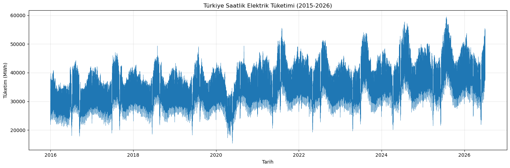
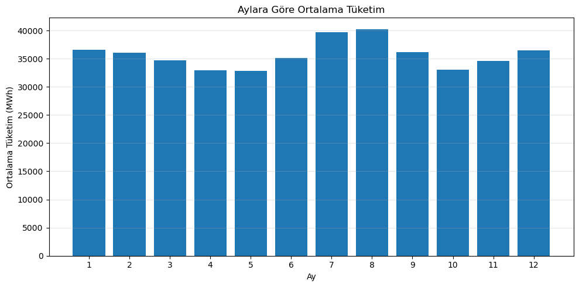
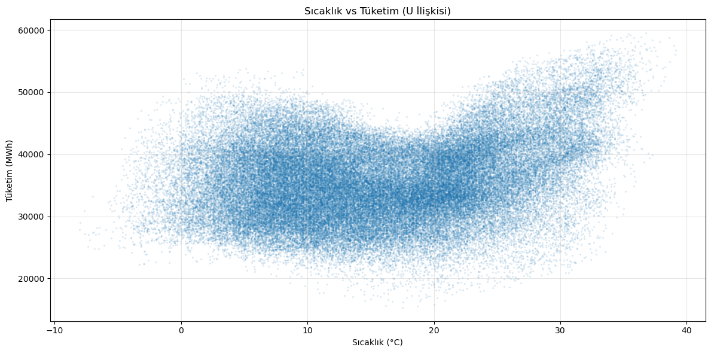
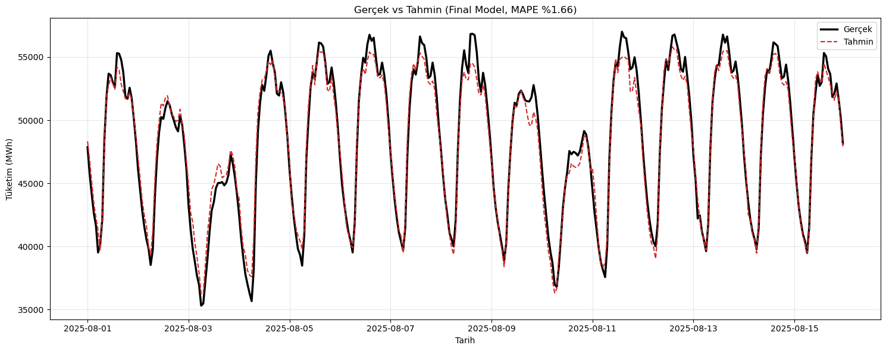

# Türkiye Saatlik Elektrik Tüketim Tahmini

Türkiye'nin ülke geneli saatlik elektrik tüketimini; geçmiş tüketim verisi, hava sıcaklığı ve resmi tatil bilgisiyle tahmin eden bir makine öğrenmesi projesi. Model, LightGBM ile kurulmuş olup test setinde **%1.62 MAPE** ve **0.979 R²** başarıya ulaşmaktadır. Ayrıca modelle etkileşimli bir **Streamlit demo** uygulaması içerir.

## İçindekiler
- [Problem](#problem)
- [Veri](#veri)
- [Yaklaşım](#yaklaşım)
- [Özellik Mühendisliği](#özellik-mühendisliği)
- [Model ve Sonuçlar](#model-ve-sonuçlar)
- [Bulgular](#bulgular)
- [Kurulum ve Çalıştırma](#kurulum-ve-çalıştırma)
- [Gelecek İyileştirmeler](#gelecek-iyileştirmeler)

## Problem

Elektrik tüketiminin doğru tahmini, şebeke operatörleri için üretim planlaması ve arz-talep dengesi açısından kritik önem taşır. Bu projede amaç, Türkiye'nin ülke geneli saatlik elektrik tüketimini geçmiş verilere dayanarak tahmin eden bir model geliştirmektir. Tahmin ufku bir sonraki saattir ve model yalnızca tahmin anında bilinebilecek geçmiş bilgileri kullanır (veri sızıntısı — data leakage — önlenmiştir).

## Veri

- **Tüketim verisi:** [EPİAŞ Şeffaflık Platformu](https://seffaflik.epias.com.tr) — Gerçek Zamanlı Tüketim (kaynak: TEİAŞ). 2015 sonundan 2026 Temmuz'a kadar saatlik veri, yıllık dosyalar halinde indirilip birleştirilmiştir.
- **Sıcaklık verisi:** [Open-Meteo Historical Weather API](https://open-meteo.com) — İstanbul, Ankara ve İzmir için saatlik 2m sıcaklık verisi. Üç şehrin ortalaması, ülke geneli sıcaklığı temsil etmek üzere kullanılmıştır.

Toplam **~92.000 saatlik gözlem** (yaklaşık 10,5 yıl).

> **Not:** Ham veri dosyaları boyutları nedeniyle bu repoda tutulmamaktadır. Verinin nasıl indirileceği [`data/README.md`](data/README.md) dosyasında açıklanmıştır.

## Yaklaşım

Proje uçtan uca şu adımlardan oluşur:

1. **Veri toplama:** 11 yıllık tüketim verisi EPİAŞ'tan yıllık dosyalar halinde indirildi.
2. **Veri temizleme:**
   - Yıllık dosyalar birleştirildi; dosya sınırlarındaki çakışan (mükerrer) kayıtlar temizlendi.
   - 2016 yaz saati geçişinden (27 Mart 2016) kaynaklanan bir eksik ve bir sıfır değer tespit edilip zaman bazlı interpolasyonla düzeltildi.
   - Sonuç: tekrarsız, eksiksiz, kesintisiz saatlik seri.
3. **Keşifçi veri analizi (EDA):** Trend, mevsimsellik (yıllık/haftalık/günlük) ve korelasyon incelendi.
4. **Özellik mühendisliği:** Gecikme (lag), hareketli ortalama (rolling), döngüsel zaman kodlaması, sıcaklık ve resmi tatil özellikleri üretildi.
5. **Modelleme:** LightGBM ile, zamana göre bölünmüş (kronolojik) train/test setleri üzerinde eğitim ve değerlendirme.
6. **İyileştirme:** Sıcaklık verisi ve resmi tatil bilgisi eklenerek, hiperparametre ayarı yapılarak model kademeli olarak geliştirildi.

## Özellik Mühendisliği

Ham veride yalnızca tüketim değeri vardı. Modelin öğrenebilmesi için aşağıdaki özellikler üretildi:

| Özellik | Açıklama |
|---|---|
| `saat`, `gun`, `ay`, `haftanin_gunu`, `yil` | Temel takvim bilgileri |
| `lag_24` | 24 saat (1 gün) önceki tüketim |
| `lag_168` | 168 saat (1 hafta) önceki tüketim |
| `rolling_mean_24` | Son 24 saatin ortalama tüketimi (sızıntı önlemek için `shift(1)` ile) |
| `rolling_std_24` | Son 24 saatin oynaklığı (standart sapma) |
| `saat_sin`, `saat_cos` | Saatin döngüsel (sin/cos) kodlaması |
| `ay_sin`, `ay_cos` | Ayın döngüsel (sin/cos) kodlaması |
| `sicaklik` | Üç büyük şehrin ortalama saatlik sıcaklığı |
| `tatil` | Resmi tatil / dini bayram günü mü? (0/1) |

**Döngüsel kodlama neden?** Saat ve ay döngüsel değişkenlerdir (23:00'ten sonra 00:00, Aralık'tan sonra Ocak gelir). Düz sayı olarak verilirse model 23:00 ile 00:00'ı birbirine uzak sanar. Sin/cos dönüşümü, bu değerleri bir daire üzerine yerleştirerek komşuluk ilişkisini korur.

**Veri sızıntısının önlenmesi:** Rolling özellikler `shift(1)` ile hesaplanmıştır; böylece bir saati tahmin ederken o saatin kendi değeri ortalamaya dahil edilmez. Ayrıca train/test ayrımı rastgele değil **kronolojik** yapılmıştır (geçmişle eğit, gelecekte test et) — bu, gerçek kullanım senaryosunu yansıtır.

## Model ve Sonuçlar

**Model:** LightGBM Regressor (`n_estimators=1000`, `learning_rate=0.05`)
**Train/Test ayrımı:** ~2016–2025 Temmuz eğitim, son 1 yıl (2025 Temmuz – 2026 Temmuz) test.

### Performans karşılaştırması

| Model | MAE (MWh) | RMSE (MWh) | MAPE | R² |
|---|---|---|---|---|
| Temel model (sıcaklıksız, 500 ağaç) | 752 | 1.131 | %1.86 | 0.9704 |
| + Sıcaklık | 697 | 1.038 | %1.73 | 0.9751 |
| + Hiperparametre ayarı | 667 | 995 | %1.66 | 0.9771 |
| + Resmi tatil (final) | **655** | **962** | **%1.62** | **0.9786** |

Her iyileştirme adımı "sorun tespit et — çöz — ölç" döngüsüyle yapıldı:

- **Sıcaklık**, RMSE'yi ~%8 iyileştirdi; iyileşme özellikle yaz aylarındaki tepe (klima kaynaklı) tüketim noktalarında belirgindir.
- **Resmi tatil** özelliği, genel MAPE'yi az etkiler (tatiller verinin ~%4'ü), ancak bayram günlerindeki hatayı çarpıcı biçimde düşürür. Örneğin 29 Ekim 2025 (Cumhuriyet Bayramı) için o günkü hata **%5.95'ten %1.78'e** inmiştir — çünkü model artık tatil günlerinde tüketimin düştüğünü biliyor.

## Bulgular



*2015-2026 arası saatlik tüketim: belirgin yükseliş trendi, yıllık mevsimsellik ve 2020 (Covid) döneminde düşüş görülüyor.*



*Aylara göre ortalama tüketim: yaz (klima) ve kış (ısıtma) aylarında zirve, geçiş mevsimlerinde düşüş.*



*Sıcaklık-tüketim ilişkisi U şeklindedir: hem soğukta hem sıcakta tüketim artar. Yaz klima etkisi daha güçlüdür.*



*Final modelin test setindeki tahminleri (kırmızı) gerçek değerlerle (siyah) karşılaştırması — 2 haftalık kesit.*

### Öne çıkan bulgular

- **Güçlü mevsimsellik:** Tüketim yaz (klima) ve kış (ısıtma) aylarında zirve yapar; geçiş mevsimlerinde düşer. Günlük döngüde gece dip, gündüz plato görülür. Hafta sonu tüketimi hafta içine göre belirgin düşüktür.
- **Sıcaklık–tüketim ilişkisi U şeklindedir:** Hem düşük hem yüksek sıcaklıklarda tüketim artar. Doğrusal korelasyon (0.25) bu ilişkiyi yakalayamaz; ancak ağaç tabanlı model yakalayabilir. Yaz klima etkisi, kış etkisinden belirgin şekilde daha güçlüdür.
- **En güçlü tahmin edici geçmiş tüketimdir:** `lag_24` ve `lag_168`, tüketimin güçlü günlük ve haftalık otokorelasyonu sayesinde modelin en değerli girdileridir.
- **Modelin sınırı ve çözümü:** Sıcaklık eklenmeden önce model, aşırı sıcak günlerdeki tepe tüketimleri eksik tahmin ediyordu; bu sıcaklık özelliğiyle giderildi. Benzer şekilde model resmi tatilleri bilmediği için bayram günlerinde yüksek hata veriyordu; tatil özelliği bunu düzeltti.
- **Tatil günleri farklı davranır:** Resmi tatil günlerinde ortalama tüketim (~29.300 MWh), normal günlerden (~35.900 MWh) yaklaşık **%18 daha düşüktür** — hafta sonu etkisinden bile güçlü.

## Kurulum ve Çalıştırma

```bash
# Depoyu klonlayın
git clone https://github.com/mustafaadalan/turkey-electricity-forecast.git
cd turkey-electricity-forecast

# Gerekli kütüphaneleri kurun
pip install -r requirements.txt

# Notebook'u açın (tüm analiz ve modelleme)
jupyter notebook notebooks/elektrik_tuketim_tahmini.ipynb

# veya interaktif demoyu çalıştırın
streamlit run app.py
```

Veriyi indirmek için [`data/README.md`](data/README.md) dosyasındaki adımları izleyin.

## Demo

Uygulama üç bölümden oluşur:
- **Tahmin:** Test setinden bir gün seçilir; model o günün 24 saatini tahmin eder ve gerçek değerlerle karşılaştırılır.
- **Model Performansı:** Genel metrikler ve seçilebilir dönemlerde tahmin-gerçek karşılaştırması.
- **Veri Analizi:** Saatlik, haftalık ve sıcaklık bazlı tüketim örüntüleri.

## Gelecek İyileştirmeler

- **Çok adımlı tahmin:** Yalnızca bir sonraki saat yerine, önümüzdeki 24–48 saati birden tahmin etme.
- **Ek hava değişkenleri:** Nem, rüzgâr, güneşlenme gibi değişkenlerin etkisi araştırılabilir.
- **Model karşılaştırması / stacking:** XGBoost, CatBoost gibi modellerle karşılaştırma ve topluluk (ensemble) yöntemleri.
- **Özellik önemi analizi:** Modelin hangi özelliklere ne kadar dayandığının detaylı incelenmesi.

---

*Bu proje, veri toplama, temizleme, özellik mühendisliği, modelleme ve iyileştirme adımlarını içeren uçtan uca bir zaman serisi çalışmasıdır.*